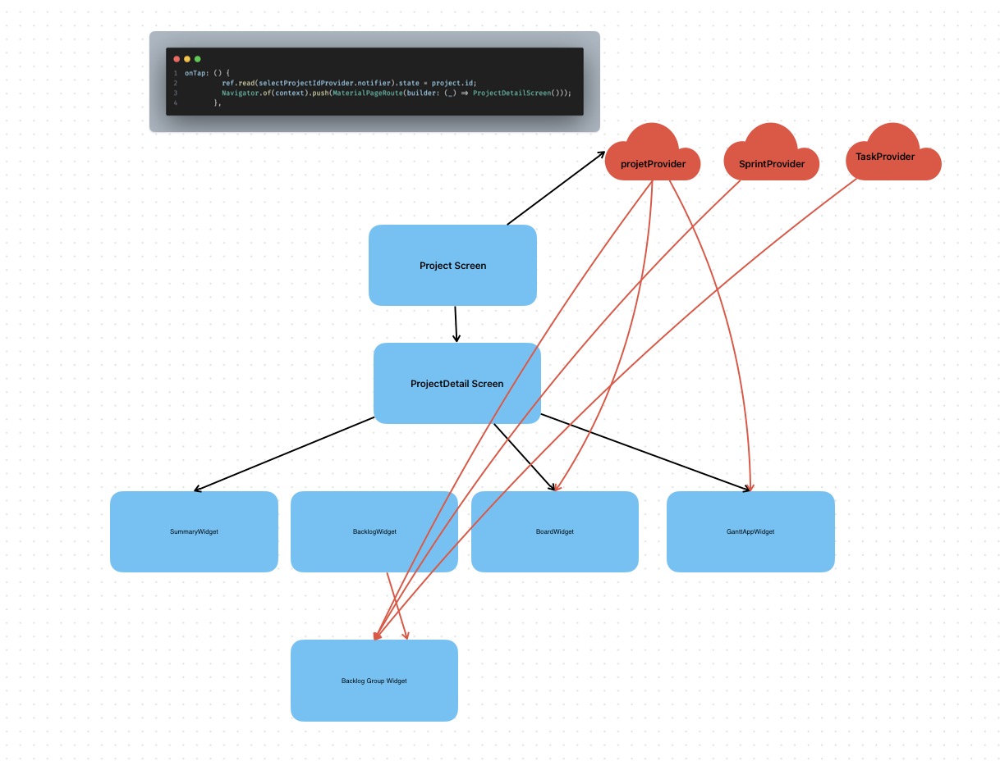

# Riverpod VS Tree: การจัดการ State ใน Flutter



## ความแตกต่างหลัก

### Traditional Provider (Tree-based)
- **ผูกกับ Widget Tree**: State จะอยู่ใน widget tree และต้องใช้ BuildContext เพื่อเข้าถึง
- **Context Dependency**: ต้องอาศัย context ของ widget ที่อยู่ใน tree
- **Nested Complexity**: เมื่อ widget ซ้อนกันหลายชั้น การส่งข้อมูลจะซับซ้อน
- **Error Prone**: เกิด context-related error ได้ง่าย เช่น การเรียกใช้ Provider นอก tree

### Riverpod
- **Independent from Widget Tree**: Provider สามารถอยู่นอก widget tree ได้
- **No Context Required**: ไม่ต้องพึ่ง BuildContext ในการเข้าถึง state
- **Global Access**: สามารถเข้าถึง provider ได้จากทุกที่ในแอป
- **Type Safe**: ตรวจสอบ type ได้ดีกว่า และป้องกัน runtime error

## ตัวอย่างจากภาพ

จากภาพแสดงให้เห็นว่า:

### 1. Provider Structure
```dart
// Global providers ที่สามารถเข้าถึงได้จากทุกที่
final projectProvider = Provider<Project>((ref) => ...);
final sprintProvider = Provider<Sprint>((ref) => ...);
final taskProvider = Provider<Task>((ref) => ...);
```

### 2. Widget Access
- **ProjectDetailScreen** สามารถเข้าถึง provider ได้โดยตรง
- **Child Widgets** (SummaryWidget, BacklogWidget, BoardWidget, GanttAppWidget) ไม่ต้องรับ props จาก parent
- **Direct Access**: ใช้ `ref.read()` หรือ `ref.watch()` เพื่อเข้าถึง state

### 3. Navigation with State
```dart
onTap: () {
  // อัปเดต state ก่อน navigate
  ref.read(selectProjectIdProvider.notifier).state = project.id;
  
  // Navigate โดยไม่ต้องส่ง parameters
  Navigator.of(context).push(
    MaterialPageRoute(builder: (_) => ProjectDetailScreen())
  );
}
```

## ข้อดีของ Riverpod

### 1. **Cleaner Code**
- ลดการส่ง props ผ่าน constructor
- Widget ไม่ต้องรู้ว่า state มาจากไหน
- Code ที่สะอาดและอ่านง่าย

### 2. **Better Testing**
- สามารถ mock provider ได้ง่าย
- Test แต่ละ provider แยกกันได้
- ไม่ต้องสร้าง widget tree เพื่อ test state

### 3. **Performance**
- Rebuild เฉพาะ widget ที่ใช้ state นั้น ๆ
- Fine-grained reactivity
- ลด unnecessary rebuild

### 4. **Error Prevention**
- Compile-time type checking
- ไม่มี context-related error
- Provider dependency injection ที่ปลอดภัย

## ตัวอย่าง Code Comparison

### Traditional Provider
```dart
class ProjectDetailScreen extends StatelessWidget {
  @override
  Widget build(BuildContext context) {
    // ต้องใช้ context และอาจเกิด error ได้
    final project = Provider.of<Project>(context);
    
    return Scaffold(
      body: Column(
        children: [
          SummaryWidget(project: project), // ส่ง props
          BacklogWidget(project: project), // ส่ง props
          BoardWidget(project: project),   // ส่ง props
        ],
      ),
    );
  }
}
```

### Riverpod
```dart
class ProjectDetailScreen extends ConsumerWidget {
  @override
  Widget build(BuildContext context, WidgetRef ref) {
    // ไม่ต้องส่ง props, child widgets เข้าถึงเองได้
    return Scaffold(
      body: Column(
        children: [
          SummaryWidget(),  // เข้าถึง provider เอง
          BacklogWidget(),  // เข้าถึง provider เอง
          BoardWidget(),    // เข้าถึง provider เอง
        ],
      ),
    );
  }
}

class SummaryWidget extends ConsumerWidget {
  @override
  Widget build(BuildContext context, WidgetRef ref) {
    // เข้าถึง state โดยตรง
    final project = ref.watch(projectProvider);
    final sprint = ref.watch(sprintProvider);
    
    return Card(
      child: Text('Project: ${project.name}'),
    );
  }
}
```

## สรุป

Riverpod ช่วยแก้ปัญหาหลักของ traditional provider:
- **ลดความซับซ้อน** ของการส่งข้อมูลผ่าน widget tree
- **เพิ่มความยืดหยุ่น** ในการจัดการ state
- **ลด error** ที่เกิดจาก context dependency
- **ปรับปรุงประสิทธิภาพ** ด้วย fine-grained reactivity

การใช้ Riverpod ทำให้โค้ดสะอาด maintain ง่าย และมีประสิทธิภาพมากขึ้น เหมาะสำหรับแอปพลิเคชันที่ซับซ้อนและต้องการจัดการ state หลาย ๆ แบบ

